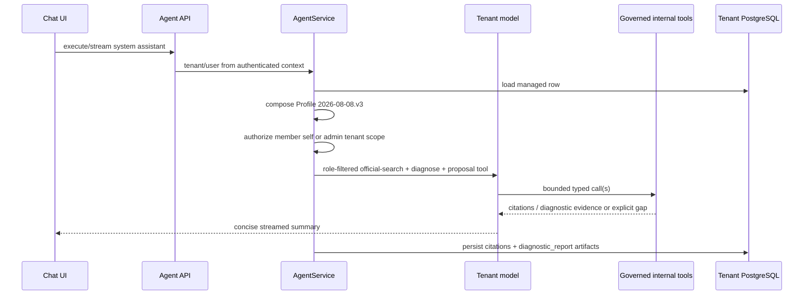
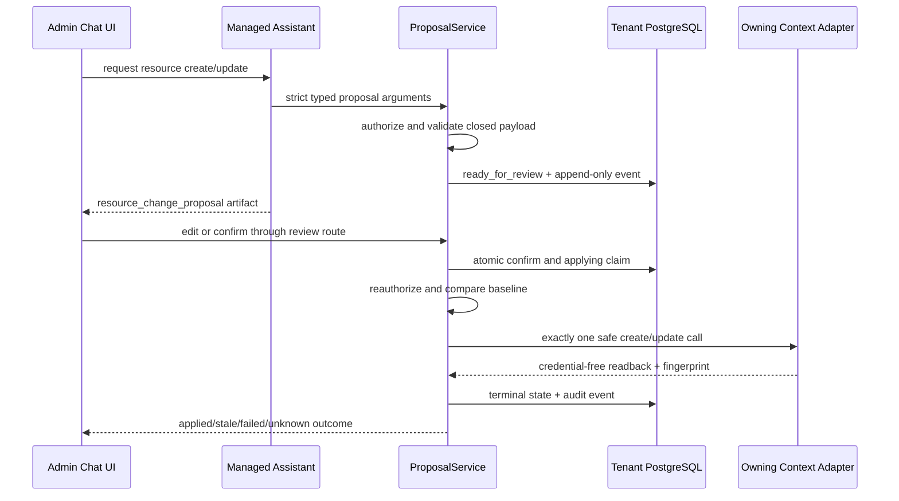
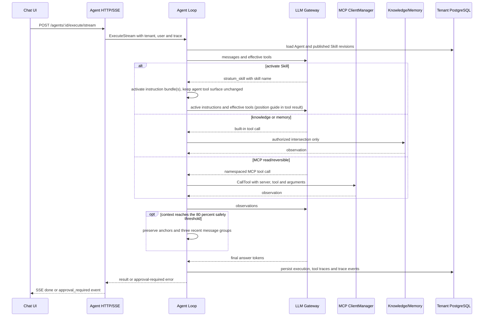
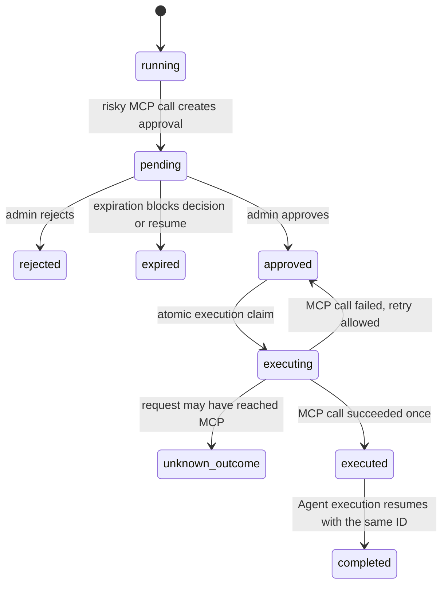

# Agent Chat Flow

> 当前事实基线：2026-07-22 工具权限 Harness 实现。路由入口见 `api/http/router.go`，执行与审批编排见
> `internal/agent/application/agent_execution.go`（Execute/ExecuteStream/ResumeExecution），ReAct 工具循环见
> `internal/agent/application/graph/react_tool.go` 等（与 react_llm.go、react_state.go 共同构成循环）。

## Platform Assistant Run

平台助手沿用同一 `/agents/:id/execute` 与 `/agents/:id/execute/stream` Agent Loop，但装配阶段先验证 tenant
模型，再组合不可变 Profile，并只注入两个 internal tools。诊断在模型调用前完成一次角色授权；后续 tool call
只能复用这份已授权且绑定 tenant/user 的请求，不能由模型扩大 scope。



相关路由：系统助手设置读取/更新走通用 Agent 路由 `GET /agents/:id` / `PUT /agents/:id`
（`id=stratum-platform-assistant`，等同化后与普通 Agent 一致）、`GET /agents`、
`POST /agents/:id/execute`、`POST /agents/:id/execute/stream`、会话与消息路由。错误正文继续使用
冻结的 `{"error":"..."}`：未配置/不可用模型为 `system assistant model unavailable`，非法模型为
`invalid system assistant model`。官方无匹配和 area 失败进入
typed artifact，不泄露上游原始错误。

## Governed Resource Proposal



只有 admin/owner 能创建、读取、编辑、取消或确认 proposal。更新操作保存去密 baseline projection 供 old/new 审阅，并
保存独立 fingerprint；apply 前再次解析 owning context 当前投影并比较 fingerprint，不同则进入 `stale`，不调用 applier。
`unknown_outcome` 表示副作用可能已发生，
API 和 UI 都不提供重试。MCP update 保留现有凭据但不允许读出或替换；Knowledge 不允许改名或上传文档；Skill 只改
draft bundle，不 publish；Agent 不允许以托管系统助手为目标。

## Normal Run



上下文实际处理规则：初始请求按 `MaxContextTokens` 和历史窗口截断较老消息；循环内请求达到预算的
80% 后，只压缩发送给 LLM 的消息副本，保留 system/user 锚点与最近 3 个完整消息组。
`HistoryCompactor` 是可选端口；未注入时用省略标记替代较早轮次。数据库会话历史、执行记录和 trace
不会被该步骤裁剪。

## Approval Run



暂停时：

1. `agent_tool_approvals.status=pending`，敏感 payload 以 AES-GCM ciphertext 保存。
2. execution record 和 checkpoint 使用 `waiting_approval`；checkpoint runtime state 只含 approval ID。
3. SSE 发送 `event: approval_required`。
4. 管理员通过 decision API 作出 `approved` 或 `rejected` 决策；批准后再调用 resume API。
5. resume 使用原 execution ID，重新解析 payload 中固定的 Skill revisions，并只允许完全匹配的
   server、tool 和 arguments 绕过审批一次。
6. 执行前以原子更新把审批从 `approved` claim 为 `executing`；MCP 失败回到 `approved`，成功转为
   `executed`，防止并发重复执行。
7. 只有能够证明请求未发送或确定失败时才能回到 `approved`；发送后的超时、取消、断连和半响应进入
   `unknown_outcome`，不能由用户重试。
8. 工具执行前重新授权，执行结果经过确定性的 Result Guard 后才进入下一轮 LLM 上下文。

## Effective Permissions

```text
MCP tools  = tenant/user permission ∩ Agent.mcpToolIds
Knowledge  = Agent.workspaceIds
Memory     = Agent.memoryScope
```

Skill 激活只注入 instruction bundle，不改变工具、知识或记忆边界（Spec D5）；Agent 始终使用自身明确 allowlist。

## Evaluation

Skill evaluation 是 Agent scenario evaluation：evaluation worker 找到绑定该 Skill 的 Agent，将被测
revision 作为 active Skill 固定注入，再通过真实 Agent Loop 执行 case。Skill revision 本身不是独立的
可执行单元。
